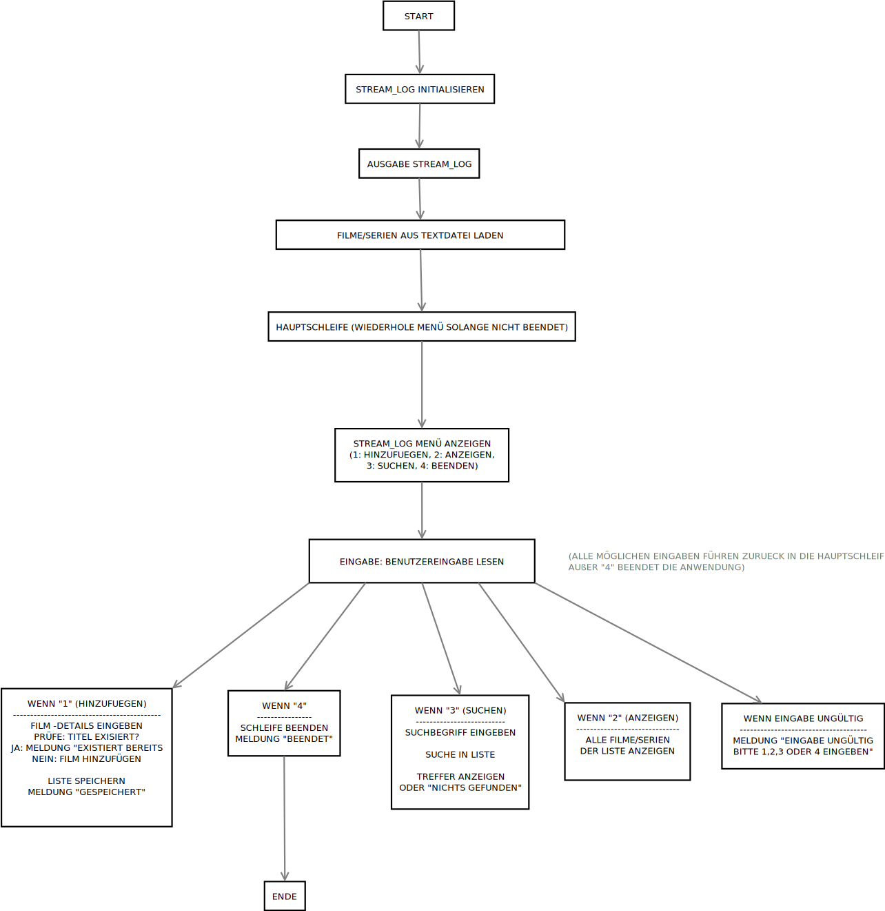

# # StreamLog: Dein persönliches Film- und Serien-Lexikon

## # Beschreibung

Dieses Projekt ist *StreamLog*, ein *konsolenbasiertes Java-Programm*, das dir hilft, den Überblick über deine angesehenen Filme und Serien zu behalten. Es funktioniert als dein persönliches digitales Lexikon, direkt in der Kommandozeile.

---

## # Funktionen

* *Medien erfassen:* Füge neue Filme und Serien mit wichtigen Details wie *Titel*, deiner *Bewertung* und dem *Sichtungsdatum* hinzu.
* *Dauerhafte Speicherung:* All deine Einträge werden *sicher in einer einfachen Textdatei* abgelegt, sodass deine Daten auch nach dem Beenden des Programms erhalten bleiben.
* *Übersichtliche Anzeige:* Lass dir jederzeit eine *tabellarische Liste* all deiner gespeicherten Medien direkt in der Konsole anzeigen.
* *Schnelle Suche:* Finde spezifische Filme oder Serien im Handumdrehen, indem du nach einem *Suchbegriff* suchst.
* *Duplikatsprüfung:* Das Programm *verhindert, dass du denselben Eintrag doppelt speicherst*, und sorgt so für ein sauberes und konsistentes Lexikon.
* *Interaktive Bedienung:* Navigiere einfach und intuitiv durch ein *Menüsystem*. Du kannst verschiedene Aktionen (Hinzufügen, Anzeigen, Suchen) direkt hintereinander ausführen, ohne das Programm neu starten zu müssen.

---

## # Anwendungslogik

---

## # Autor

* [Dennis Garscha]
